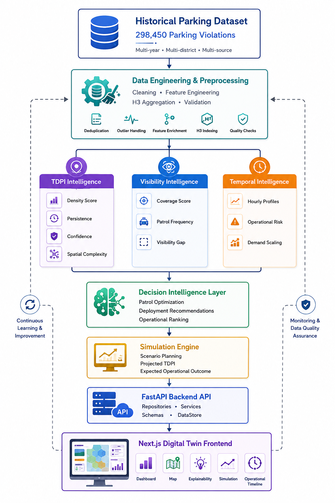

<div align="center">

# ParkOptic

### AI-Powered Parking Visibility & Enforcement Intelligence Platform

**Transforming historical parking data into actionable operational intelligence through Artificial Intelligence, Machine Learning, Spatial Analytics, and Explainable Decision Support.**

---

[](https://www.python.org/)
[](https://fastapi.tiangolo.com/)
[](https://nextjs.org/)
[](https://www.typescriptlang.org/)
[](https://catboost.ai/)
[](https://h3geo.org/)
[](LICENSE)

---


*A production-grade AI-powered operational intelligence platform for parking-induced congestion management.*

</div>

---

## Overview

ParkOptic is an AI-powered operational intelligence platform designed to help traffic enforcement agencies identify illegal parking hotspots, quantify their impact on urban traffic flow, detect enforcement blind spots, and optimize patrol deployment using predictive analytics.

Unlike traditional monitoring systems, ParkOptic combines Machine Learning, mathematical intelligence models, temporal analytics, geospatial processing, and explainable AI to transform historical parking violation records into actionable operational insights.

The platform follows a layered intelligence pipeline that integrates Traffic Disruption Priority Index (TDPI), Visibility Gap Intelligence, Temporal Intelligence, Smart Patrol Allocation, and Operational Impact Simulation into a unified decision-support system.

---

## Live Demonstration

| Resource | Link |
|----------|------|
| **Live Application** | https://parkoptic.vercel.app |
| **Backend API** | *(Add your Cloud Run URL)* |
| **Engineering Design Document** | `docs/ParkOptic_Engineering_Design_Document.pdf` |
| **Presentation** | *(Add PPT/PDF link if available)* |

---

> **Project Status**
>
> ParkOptic is a production-grade prototype developed. The platform demonstrates how Artificial Intelligence, Machine Learning, Spatial Intelligence, and Operational Analytics can be integrated into a unified decision-support system for parking-induced congestion management.
>

## About ParkOptic

Urban parking violations are a major contributor to traffic congestion, inefficient enforcement, and suboptimal utilization of patrol resources. Existing traffic management systems are largely reactive, relying on manual monitoring and historical reporting rather than predictive operational intelligence.

ParkOptic is an AI-powered Operational Intelligence Platform that transforms historical parking violation data into actionable insights using **Artificial Intelligence, Machine Learning, Spatial Analytics, and Explainable Decision Support**. By integrating the **Traffic Disruption Priority Index (TDPI)**, **Visibility Gap Intelligence**, **Temporal Intelligence**, **Smart Patrol Allocation**, and **Operational Impact Simulation**, the platform enables authorities to identify critical congestion hotspots, forecast operational pressure, optimize patrol deployment, and evaluate expected outcomes before deployment.

Through its interactive Digital Twin, ParkOptic empowers traffic enforcement agencies to transition from reactive monitoring to proactive, data-driven operational planning.

## Features

- **Traffic Disruption Priority Index (TDPI)** – Quantifies the operational severity of parking-induced congestion using a composite mathematical model.
- **Visibility Gap Intelligence (VGI)** – Detects enforcement blind spots by analyzing patrol coverage and monitoring effectiveness.
- **Temporal Intelligence Engine** – Models hourly operational pressure using historical parking patterns and machine learning predictions.
- **Smart Patrol Allocation** – Recommends optimal patrol deployment based on disruption severity, visibility gaps, and forecast demand.
- **Operational Impact Simulation** – Estimates the expected reduction in traffic disruption and visibility gaps before deployment.
- **Explainable AI** – Generates transparent, evidence-based recommendations with interpretable operational reasoning.
- **Interactive Digital Twin** – Visualizes city-wide operational intelligence through maps, dashboards, and simulation tools.
- **Production-Ready Architecture** – Modular FastAPI backend, Next.js frontend, and optimized intelligence pipeline designed for scalability.

## System Architecture

<p align="center">
  
</p>

ParkOptic follows a modular, layered architecture consisting of data engineering, operational intelligence services, decision-support engines, and an interactive Digital Twin frontend. All analytical computations are performed within the FastAPI backend, ensuring a single source of truth for every operational metric while the frontend focuses exclusively on visualization, simulation, and user interaction.

## Technology Stack

<p align="center">


</p>

| Category | Technologies |
| :-------- | :----------- |
| **Frontend** |  Next.js 15 •  React 19 •  TypeScript •  Tailwind CSS |
| **Backend** |  FastAPI •  Python 3.12 |
| **Machine Learning** | 🤖 CatBoost •  Scikit-learn |
| **Data Processing** |  Pandas •  NumPy |
| **Spatial Analytics** | 🌐 Uber H3 |
| **Visualization** | 🗺️ Deck.GL • 🧭 MapLibre GL |
| **State Management** | ⚡ TanStack React Query |
| **Data Storage** | 📦 Apache Parquet |
| **Deployment** | ▲ Vercel •  Northflank|
| **Containerization** |  Docker |


## Project Highlights

- AI-powered Operational Intelligence Platform for parking-induced congestion management.
- CatBoost Machine Learning Model for violation validation & demand forecasting.
- Traffic Disruption Priority Index (TDPI) for congestion quantification.
- Visibility Gap Index (VGI) for enforcement coverage analysis.
- Temporal Intelligence Engine for hourly operational forecasting.
- Smart Patrol Allocation Engine for AI-assisted resource optimization.
- Operational Impact Assessment & Simulation before deployment.
- Explainable AI for transparent decision support.
- Interactive Digital Twin with Uber H3 geospatial visualization.
- Built on a production-grade FastAPI and Next.js architecture.
- Analyzed 298,450 historical parking violation records across Bengaluru.

## Repository Structure

```text
ParkOptic
├── backend
│   ├── app
│   │   ├── api/                 # REST API routes
│   │   ├── core/                # Configuration & data management
│   │   ├── ml/                  # ML models & explainability
│   │   ├── repositories/        # Data access layer
│   │   ├── schemas/             # API schemas
│   │   └── services/            # Operational intelligence engines
│   │
│   ├── data/                    # Raw & processed datasets
│   ├── pipelines/               # Data engineering & ML pipelines
│   ├── artifacts/               # Model artifacts & explainability outputs
│   ├── Dockerfile
│   └── requirements.txt
│
├── frontend
│   ├── src
│   │   ├── app/                 # Next.js application routes
│   │   ├── components/          # Reusable UI components
│   │   ├── config/              # Application configuration
│   │   ├── hooks/               # Custom React hooks
│   │   ├── services/            # API & data adapters
│   │   ├── styles/              # Global styles
│   │   └── utils/               # Shared utilities
│   │
│   ├── public/
│   └── package.json
│
├── docs/                        # Documentation & architecture assets
├── LICENSE
└── README.md
```
