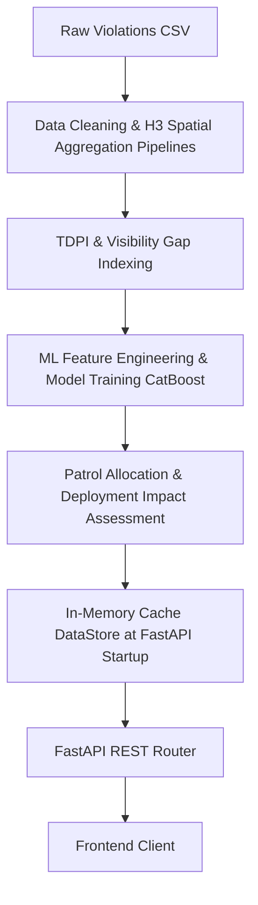

# ParkOptic Backend Architecture & Technical Documentation

This document provides a detailed breakdown of the ParkOptic backend project.

---

## 1. High-Level Architecture & Design

ParkOptic is an intelligent, data-driven decision support system designed to assist urban traffic enforcement (specifically Bengaluru Traffic Police) in identifying parking violation hotspots, predicting future violations, diagnosing enforcement gaps, and generating optimized patrol allocations.

The backend consists of two main pillars:
1. **FastAPI Web Application**: Serves processed spatial intelligence, aggregations, dashboard statistics, and ML predictions to the frontend via high-performance REST APIs. It relies on an **In-Memory Data Store** that loads data into RAM at startup, grouping multi-dimensional indicators by Uber's H3 Spatial Index (Resolution 9) for sub-millisecond lookups.
2. **Offline Data & Machine Learning Pipeline**: A 13-stage sequential data-processing pipeline that performs data cleaning, H3 aggregation, index calculation (TDPI & VGI), feature engineering, model training (CatBoost Classification and Regression), SHAP explainability generation, and impact assessment.



---

## 2. Technology Stack & Key Dependencies

* **Web Framework**: FastAPI (Uvicorn as ASGI server, Pydantic for validation, Gzip & CORS middleware).
* **Machine Learning**: 
  * **CatBoost**: `CatBoostClassifier` for predicting violation validation probabilities, and `CatBoostRegressor` for weekly escalation forecasting.
  * **SHAP**: Machine learning model interpretability (TreeExplainer) to generate feature importance plots and explain recommendations.
  * **Scikit-Learn**: Dataset splitting, scaling, and evaluation metrics (precision, recall, F1, ROC-AUC, MAE, R²).
* **Spatial/Geo-Indexing**: Uber's `h3` library (Resolution 9 hexagonal cells).
* **Data Processing**: `pandas` and `numpy` for data manipulation, `pyarrow` for fast Parquet file I/O.
* **Logging & Config**: `loguru` for logging, `pydantic-settings` for config management.

---

## 3. Directory & File Structure

```
c:/parkOptic/backend/
├── app/
│   ├── api/
│   │   └── v1/
│   │       ├── routes/
│   │       │   ├── dashboard.py       # Dashboard summary stats route
│   │       │   ├── health.py          # API status route
│   │       │   └── hotspots.py        # Hotspot map and details routes
│   │       └── api.py                 # Core API route orchestrator (includes placeholders)
│   ├── core/
│   │   ├── data_store.py              # In-memory caching singleton (DataStore)
│   │   └── settings.py                # Immutable Pydantic-based configuration settings
│   ├── ml/
│   │   ├── explainability/
│   │   │   ├── hotspot_forecasting_explainer.py  # Generates SHAP plots for forecasting
│   │   │   └── violation_validation_explainer.py # Generates SHAP plots for validation
│   │   ├── features/
│   │   │   ├── hotspot_forecasting_feature_builder.py # Aggregates features and lags
│   │   │   └── validation_feature_builder.py          # Builds classifier dataset
│   │   ├── models/
│   │   │   ├── forecast_metadata.pkl                  # Serialized metrics/params
│   │   │   ├── hotspot_forecasting_model.cbm          # Trained CatBoost Regressor
│   │   │   └── violation_validation_model.cbm         # Trained CatBoost Classifier
│   │   └── training/
│   │       ├── hotspot_forecasting_trainer.py         # Regressor training logic
│   │       └── violation_validation_trainer.py        # Classifier training logic
│   ├── repositories/
│   │   ├── base_repository.py         # Base DB interfaces (not fully utilized)
│   │   ├── dashboard_repository.py    # Aggregates system metrics & distributions
│   │   └── hotspot_repository.py      # Main query endpoint for cache lookups
│   ├── schemas/
│   │   ├── dashboard.py               # Pydantic schemas for dashboard metrics
│   │   ├── health.py                  # Pydantic schemas for healthcheck endpoint
│   │   └── hotspot.py                 # Pydantic schemas for hotspot details/map
│   ├── services/
│   │   ├── deployment_impact_assessment_service.py # Evaluates ROI & expected risk reductions
│   │   ├── normalization_service.py                # Math scaling utilities (Log, MinMax, safe divide)
│   │   ├── smart_patrol_allocation_service.py     # Weighted operational priority ranking
│   │   ├── tdpi_service.py                         # Computes Traffic Disruption Index
│   │   └── visibility_gap_service.py               # Computes Visibility Gap Index
│   └── main.py                        # FastAPI Application Entrypoint (Startup/Shutdown lifespans)
├── config.py                          # Pipeline project paths & filenames configuration
├── requirements.txt                   # Dependency checklist
├── utils/
│   └── logger.py                      # Customized loguru console writer
└── data/
    ├── raw/                           # Original raw violations.csv
    ├── processed/                     # Parquet datasets (.parquet) generated by pipelines
    └── ml/                            # Generated training datasets
```

---

## 4. Component Input/Output & Core Logic

### A. Core Services (`app/services/`)

#### 1. `normalization_service.py`
* **Purpose**: General math functions for processing raw metrics.
* **Functions**:
  * `safe_divide(num, den)`: Returns `num / den`, or `0` if `den <= 0`.
  * `log_scale(series)`: Log-normalizes a pandas series mapping from $[0, 100]$. Formula: $\frac{\log(1 + x)}{\log(1 + \max(x))} \times 100$.
  * `minmax_scale(series)`: Min-Max scales a pandas series mapping from $[0, 100]$.

#### 2. `tdpi_service.py`
* **Purpose**: Calculates the **Traffic Disruption Potential Index (TDPI)**, representing how disruptive parking violations are in a given H3 cell.
* **Weights**: Density ($35\%$), Persistence ($25\%$), Enforcement Confidence ($15\%$), Repeat Offender Pressure ($15\%$), Spatial Complexity ($10\%$).
* **Input**: Aggregated H3 spatial stats DataFrame (including `violations_per_day`, `active_days`, `approval_rate`, `repeat_offenders`, `unique_vehicles`, `junctions`, `police_stations`).
* **Output**: DataFrame with computed sub-scores (`density_score`, `persistence_score`, `confidence_score`, `repeat_pressure_score`, `spatial_complexity_score`) and final `tdpi_score` (capped at $[0, 100]$), `tdpi_percentile`, and `risk_category` (CRITICAL, HIGH, MEDIUM, LOW, MINIMAL).

#### 3. `visibility_gap_service.py`
* **Purpose**: Calculates the **Visibility Gap Index (VGI)**, identifying areas with high disruption potential that receive poor enforcement attention.
* **Input**: DataFrame with `tdpi_score`, `unique_devices`, `active_days`, `approval_rate`.
* **Output**: DataFrame with:
  * `coverage_score`: Weighted index ($50\%$ device coverage, $30\%$ patrol frequency, $20\%$ approval/confidence rate).
  * `visibility_gap_index`: calculated as $TDPI \times (1 - \frac{Coverage}{100})$.
  * `vgi_percentile`, `recommended_priority`, `gap_category` (CRITICAL_GAP, HIGH_GAP, etc.).

#### 4. `smart_patrol_allocation_service.py`
* **Purpose**: Recommends tactical deployment configurations for enforcement teams.
* **Weights**: TDPI ($30\%$), Forecast ($25\%$), VGI ($25\%$), Spatial Criticality ($10\%$), Tier ($10\%$).
* **Input**: DataFrame with visibility gap metrics merged with predicted violations.
* **Output**: DataFrame with:
  * `deployment_score`: Combined weighted priority.
  * `deployment_priority` (IMMEDIATE, HIGH, MEDIUM, LOW).
  * `recommended_patrol_units`: Calculated based on forecasted violations and deployment score.
  * `estimated_operational_risk_reduction`: Expected drop in TDPI/risk.

#### 5. `deployment_impact_assessment_service.py`
* **Purpose**: Estimates operational outcomes of executing the recommended patrol plans.
* **Input**: Smart patrol allocation DataFrame.
* **Output**: DataFrame containing:
  * `estimated_weekly_violations_addressed`: Estimated violations covered.
  * `projected_tdpi_score`: Caclulated TDPI score remaining post-patrol.
  * `operational_improvement_percent`: Estimated percentage drop in disruption.
  * `patrol_roi`: Efficiency ROI ratio.

---

### B. Machine Learning Engine (`app/ml/`)

#### 1. Violation Validation Classifier
* **Train module (`training/violation_validation_trainer.py`)**:
  * **Input**: `validation_dataset.parquet`
  * **Output**: `violation_validation_model.cbm` (CatBoostClassifier) and `validation_predictions.parquet`.
  * **Goal**: Predicts if a citation will be `APPROVED` or `REJECTED/DUPLICATE` based on feature inputs (e.g., vehicle type, device, time, junction).
* **Explainability (`explainability/violation_validation_explainer.py`)**:
  * **Input**: CatBoost model & training features.
  * **Output**: SHAP summary and bar charts saved to `artifacts/` highlighting key indicators influencing approval rates.

#### 2. Hotspot Forecasting Regressor
* **Train module (`training/hotspot_forecasting_trainer.py`)**:
  * **Input**: `forecasting_dataset.parquet`
  * **Output**: `hotspot_forecasting_model.cbm` (CatBoostRegressor) predicting the logarithm of violations.
* **Explainability (`explainability/hotspot_forecasting_explainer.py`)**:
  * **Input**: Forecasting CatBoost Regressor.
  * **Output**: SHAP plots showing temporal and structural features (e.g., lag terms, rolling average, vehicle count).

---

## 5. The 13 Data Pipelines (`pipelines/`)

The pipelines are intended to be run sequentially (`01` through `13`):

1. **`01_clean_data.py`**
   * *Input*: `data/raw/violations.csv`
   * *Output*: `data/processed/cleaned_violations.parquet`
   * *Action*: Standardizes timestamp formats, corrects vehicle information, labels operational peak periods, and filters columns.
2. **`02_h3_aggregation.py`**
   * *Input*: `cleaned_violations.parquet`
   * *Output*: `data/processed/hex_aggregates.parquet`
   * *Action*: Indexes GPS points to Uber H3 cells (Resolution 9) and counts total, approved, unique vehicle violations, repeat offenders, and local infrastructure features.
3. **`03_tdpi_calculation.py`**
   * *Input*: `hex_aggregates.parquet`
   * *Output*: `data/processed/tdpi_scores.parquet`, `docs/tdpi_report.md`
   * *Action*: Evaluates Traffic Disruption indices.
4. **`04_visibility_gap.py`**
   * *Input*: `tdpi_scores.parquet`
   * *Output*: `data/processed/visibility_gap.parquet`, `docs/visibility_gap_report.md`
   * *Action*: Combines device density, enforcement frequencies, and approval histories to measure visibility gaps.
5. **`05_patrol_optimizer.py`**
   * *Input*: `visibility_gap.parquet`, `data/processed/forecast_predictions.parquet`
   * *Output*: `data/processed/patrol_recommendations.parquet`
   * *Action*: Generates strategic patrol allocations.
6. **`06_build_validation_dataset.py`**
   * *Input*: `cleaned_violations.parquet`
   * *Output*: `data/ml/validation_dataset.parquet`
   * *Action*: Engineers feature columns (e.g., hour, day-of-week, peak-periods) for citation validity classification.
7. **`07_train_validation_classifier.py`**
   * *Input*: `validation_dataset.parquet`
   * *Output*: `models/violation_validation_model.cbm`, `validation_predictions.parquet`
   * *Action*: Trains CatBoost model and outputs performance metrics.
8. **`08_generate_validation_explainability.py`**
   * *Input*: CatBoost validation model.
   * *Output*: SHAP plots and logs.
9. **`09_build_weekly_hex_aggregates.py`**
   * *Input*: `cleaned_violations.parquet`
   * *Output*: `data/processed/weekly_hex_aggregates.parquet`
   * *Action*: Groups spatial counts into weekly time buckets for temporal forecasting.
10. **`10_build_forecasting_dataset.py`**
    * *Input*: `weekly_hex_aggregates.parquet`
    * *Output*: `data/processed/forecasting_dataset.parquet`
    * *Action*: Generates lag indicators (Lag-1, Lag-2, Lag-3 weeks) and rolling stats for forecasting.
11. **`11_train_hotspot_forecasting_model.py`**
    * *Input*: `forecasting_dataset.parquet`
    * *Output*: `models/hotspot_forecasting_model.cbm`
    * *Action*: Trains CatBoost Regressor to predict weekly violation rates.
12. **`12_deployment_impact_assessment.py`**
    * *Input*: `patrol_recommendations.parquet`
    * *Output*: `data/processed/deployment_impact.parquet`
    * *Action*: Measures expected ROI, reduction in tdpi metrics, and generates impact summary logs.
13. **`13_generate_hotspot_forecasting_explainability.py`**
    * *Input*: CatBoost Forecasting Regressor.
    * *Output*: Visual SHAP charts.
